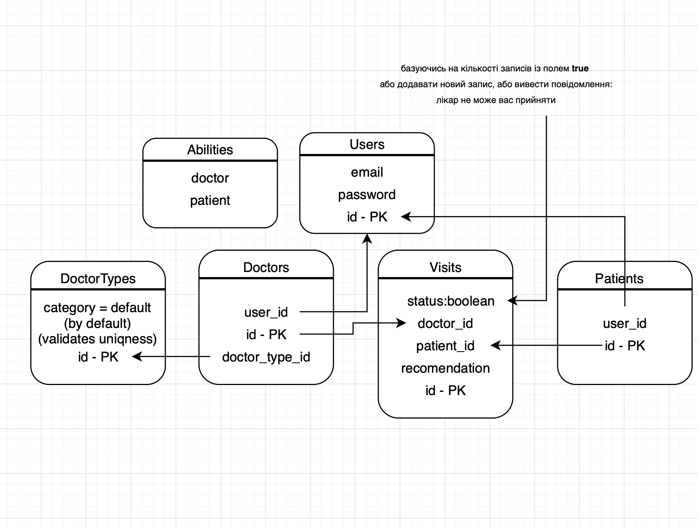
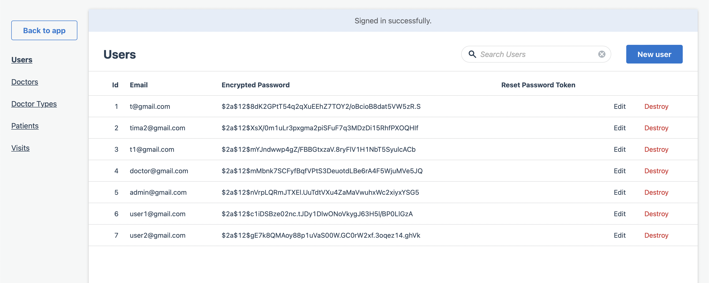
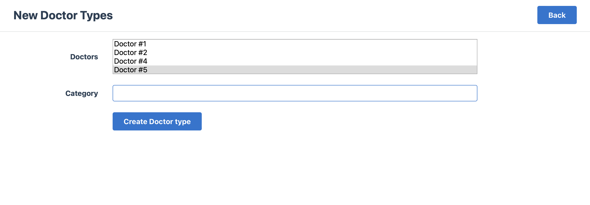
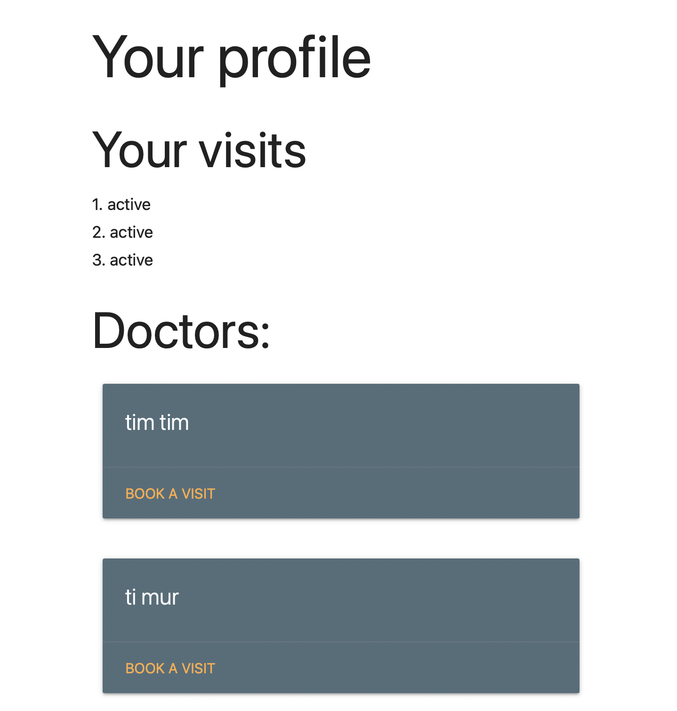
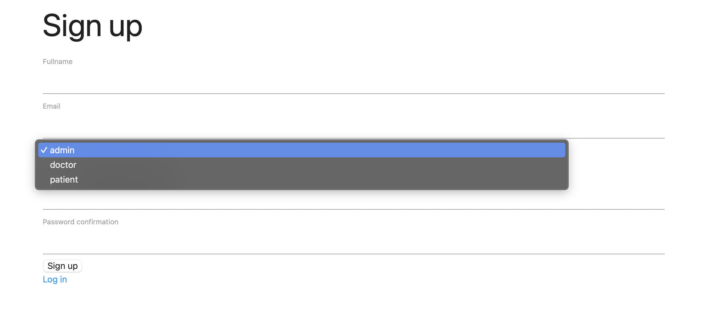

# Codica Test
## Structure of my db

### Credentials:
1. admin@gmail.com, 123456
2. doctor@gmail.com, 123456
3. patient@gmail.com, 123456

### Implemented:
- tests for validations and assosiations via rspec, shoulda-mathers
- devise registration + added field role and fullname to registration

### More pics:
- admin page

- admin-new-category page

- patient-books page

- patient-profile page

- roles when registration

